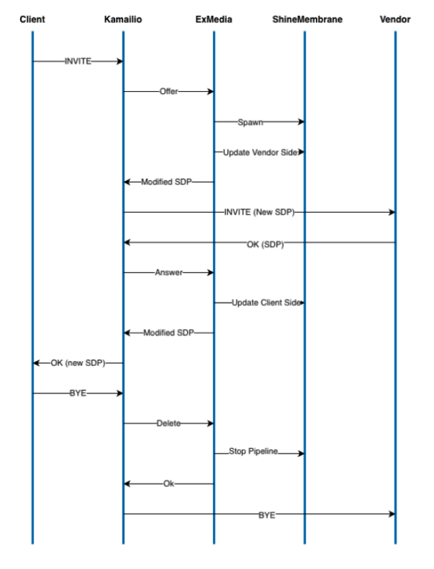

# Kamailio Overview

Kamailio is an open-source SIP server that handles VoIP signaling. It manages call setups, routing, and tear-downs, but does not process the actual media streams.

## Usage and Configuration

You configure Kamailio using its native scripting language in a `kamailio.cfg` file. This configuration script is split into three main parts: global parameters, module settings, and routing blocks. The routing blocks contain the logic that dictates exactly how Kamailio handles and routes incoming SIP requests and responses. Modern versions of Kamailio also support KEMI (Kamailio Embedded Interface), which allows developers to write these routing blocks in general-purpose languages like Python, Lua, or JavaScript instead of the native domain-specific language.

## Motivation for ex_kamailio

Kamailio is widely adopted because there are few open-source alternatives capable of handling high-volume SIP signaling and routing efficiently. However, integrating it into Elixir ecosystems requires significant effort. The purpose of the `ex_kamailio` package is to simplify this integration. We would focus strictly on use cases that could possibly utilize the Membrane Framework. Rather than attempting to support every Kamailio feature, the library would target scenarios where a server-side Membrane Pipeline might intercept, relay, and modify multimedia streams between two or more clients. This would allow developers to easily implement custom stream manipulations, such as AI background noise reduction in phone calls in BTS project, while Kamailio handles the underlying SIP signaling.

## Integration Approach 1: RTP Engine Protocol (Suggested)

This approach relies on Kamailio's `rtpengine` module to bridge Kamailio's signaling with Membrane's media processing. Kamailio communicates with the Elixir application using the advanced "ng" control protocol, which sends Bencode-encoded data over a UDP socket.

Let's say client A wants to exchange multimedia with client B and client A initiates the call. The flow of establishing the connection between would be as follows:

1. Client A sends `INVITE` containing SDP to Kamailio.
2. Kamailio sends this SDP over websocket to `ex_kamailio`.
3. `ex_kamailio` forwards it to the developer's custom code.
4. Developer's custom code responses with SDP containing IP address of Membrane Endpoint that will be used to exchange multimedia with client B.
5. `ex_kamailio` passes this SDP to Kamailio, and Kamailio sends it in `INVITE` to client B.
6. Client B responds with `OK`, its SDP answer is sent via Kamailio and `ex_kamailio` to the developer's custom code.
7. Now developer's custom code passes to `ex_kamailio` IP address Membrane will use to exchange multimedia with client A.
8. `ex_kamailio` sends it to Kamailio.
9. Kamailio wraps it in an `OK` message and forwards it to client A.

The diagram below shows the flow of the messages in the client project, that already implemented Kamailio integration in Elixir with analogical flow as above:

### Handling NAT and Dynamic IPs (Latching)

In real-world scenarios, client IPs are hidden behind NAT. This integration solves this using Symmetric RTP (Latching). The Elixir application allocates a port on Membrane and tells Kamailio to send that port to the client. Membrane's `UDP.Source` listens on this port without knowing the client's actual IP beforehand. When the client sends its first RTP packet, Membrane inspects the packet headers, extracts the true source IP and port, and "latches" onto them. From that point on, Membrane knows exactly where to send the return media stream.

We already have an existing project with a working Kamailio configuration that implements this protocol, so we only need to extract the part of the code into a standalone library. The author of the library, Javier Gallart from BTS, gave us permission to open source its code if we only mention there author and the company.

## Integration Approach 2: Erlang Node (C-Node)

The second approach uses Kamailio's `erlang` module, which allows Kamailio to act as a hidden C-Node in an Erlang cluster. The module leverages the `ei` (Erlang Interface) C library to handle the Erlang binary term format natively. Because it serializes data into native Erlang terms instead of plain text or JSON, this approach is highly performant. For node discovery to work, the Erlang Port Mapper Daemon (`epmd`) must be running on the Kamailio server.

The module provides two primary ways to interact with Elixir:

- **Synchronous RPC (`erl_rpc`):** Kamailio executes an Elixir function and waits for the result. This is useful for immediate routing decisions, but it blocks the Kamailio worker process until Elixir replies.
- **Asynchronous Messaging (`erl_send` / `erl_reg_send`):** Kamailio sends a fire-and-forget message to an Elixir PID or registered process. This is ideal for logging, CDR generation, or event tracking without blocking SIP traffic.

While the transport mechanism differs from the RTP Engine protocol, the core workflow remains the same: Kamailio handles the SIP signaling and queries Elixir to dictate routing and media handling logic.

This approach in general is more flexible than using RTP Engine protocol and allows to cover more use cases, however if we want to focus only on Membrane-friendly use cases, the first approach should be sufficient. It will also be easier to implement, since we already have a working project that implements this approach.
